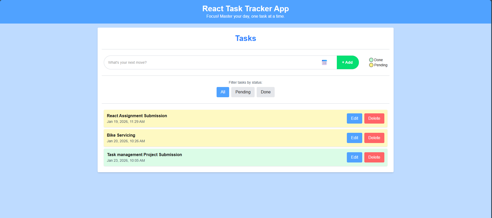

# 📋 Task Tracker App

A modern task management web application built with **React** and **Next.js**, designed to help you keep track of tasks efficiently with a clean and intuitive interface.

🚀 **Live Demo:** [https://task-tracker-kohl-eight.vercel.app](https://task-tracker-jekode.vercel.app/)

---

## 🧠 About The Project

This is a beginner‑friendly task tracker app built as part of hands‑on practice with React and Next.js. It allows users to:

- View a list of tasks
- Add new tasks
- Delete tasks
- Update tasks
- Mark tasks as done or pending

The project emphasizes simplicity, performance, and responsiveness.

---

## 🛠️ Built With

Technologies used to build this project:

- **Next.js** – React framework with SSR and routing
- **React** – UI library
- **TypeScript** – Type safety and improved developer experience
- **CSS Modules** / Tailwind CSS – Styling

---

## 📦 Features

✔ Add new tasks  
✔ Mark tasks complete  
✔ Remove tasks  
✔ Persistent state
✔ Responsive UI

---

## 📸 Demo Preview

<p align="center">
  
</p>

---

## 🚀 Getting Started

Follow these steps to run the project locally:

1. **Clone the repository**

    ```bash
    git clone https://github.com/JekenMaharjan/Task-Tracker.git
    cd Task-Tracker
    ```
    
2. **Install dependencies**
    
    ```bash
    cd client
    npm install
    ```
    or with yarn
    ```bash
    yarn install
    ```

3. **Run the development server**

    ```bash
    npm run dev
    ```
    or with yarn
    ```bash
    yarn dev
    ```

4. **Open http://localhost:3000 in your browser to view the app.**

---

## 🤝 Contributing

Contributions are always welcome! To contribute:

1. **Fork the repository.**


2. **Create your feature branch:**

    ```bash
    git checkout -b feature/YourFeature
    ```

3. **Commit your changes:**

    ```bash
    git commit -m "Add new feature"
    ```

4. **Push to the branch:**

    ```bash
    git push origin feature/YourFeature
    ```

5. **Open a Pull Request.**

---

## 📄 License

This project is licensed under the [MIT License](https://choosealicense.com/licenses/mit/).

---

## 📬 Contact

For any inquiries, reach out to us at:

- **Email:** [maharjanjeken@gmail.com](mailto:maharjanjeken@gmail.com)
- **Github:** [Jekode](https://github.com/JekenMaharjan)

---

## 🌐 Connect with Me

> 🌐 Portfolio: [**jekenmaharjan.com.np**](https://jekenmaharjan.com.np)

> [](https://www.linkedin.com/in/jekenmaharjan/)  [](https://github.com/JekenMaharjan)  [](https://x.com/JekenMaharjan)  [](https://linktr.ee/JekenMaharjan)

📬 Email: [maharjanjeken@gmail.com](mailto:maharjanjeken@gmail.com)


